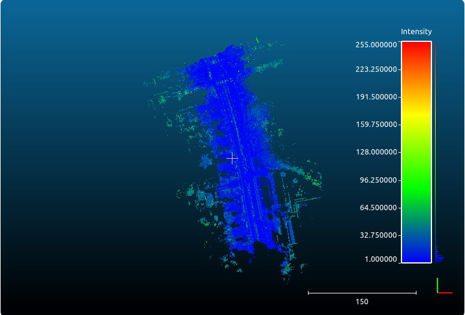
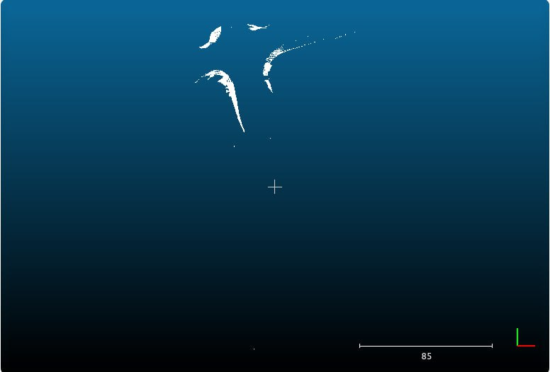
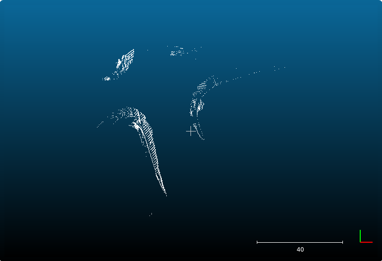

# Borders segmentation
Детектирование поребриков в трехмерном облаке точек. Программа принимает на вход файл с исходными данными и генерирует файл, в котором содержатся только координаты точек, являющихся частью поребрика.
## Входные данные
В качестве входных данных исползуется датасет [Торонто](https://github.com/WeikaiTan/Toronto-3D). Для выполнения был использован файл `L004.ply`.
## Результаты
Для визуализации использовальзовалась программа [CloudCompare](https://www.cloudcompare.org).
Модифицированный алгоритм основан на ([A Practical Point Cloud Based Road Curb Detection Method for Autonomous Vehicle](https://www.researchgate.net/publication/318823588_A_Practical_Point_Cloud_Based_Road_Curb_Detection_Method_for_Autonomous_Vehicle)).
Помимо этого добавлен фильтр, который убирает отдалённые точки
|      Оригинальное облако     |     Первоначальный алгоритм      |
|:----------------------------:|:--------------------------------:|
|       |            |

|                 Модифицированный алгоритм                       |
|:---------------------------------------------------------------:|
|                                         |

## Требования
- Python 3.8.10
- NumPy 1.23.4
- plyfile 1.0.0
- pylas 0.4.3
## Установка
    pip install -r requirements.txt
## Использование
```
python main.py ply_path [--las_path las_path] [--function function]
positional argument:
    ply_path            путь к .ply файлу для обработки

optional argument:
    --las_path las_path путь для сохранения выходного .las файла
    --function function выбор функции для анализа, defaut - modified, possible arguments - ['modified', 'w_classes']
```
